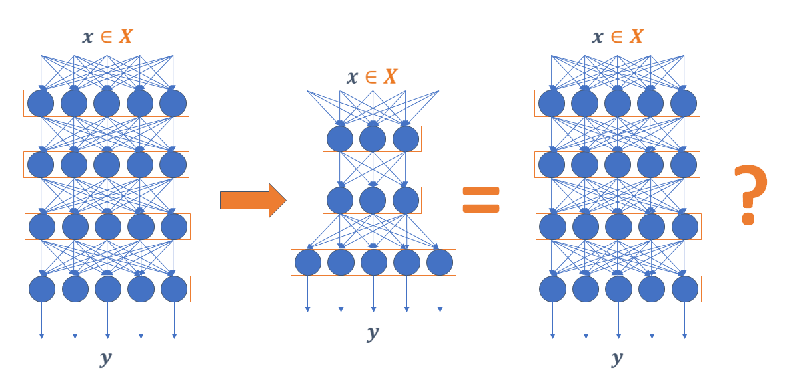

# Exact Compression
[Exact-Compression](https://proceedings.neurips.cc/paper/2021/file/e35d7a5768c4b85b4780384d55dc3620-Paper.pdf) is an approach to compress a rectifier network while exactly preserving its underlying functionality with respect to a given input domain if some of its neurons are stable.

<p style="text-align:center;"></p>

## Implementation
We will release the code soon!

## Citing Exact-Compression
Please cite Exact-Compression in your publication if it helps your research:

```
@article{serra2021scaling,
  title={Scaling Up Exact Neural Network Compression by ReLU Stability},
  author={Serra, Thiago and Yu, Xin and Kumar, Abhinav and Ramalingam, Srikumar},
  journal={Advances in Neural Information Processing Systems},
  volume={34},
  year={2021}
}
```
